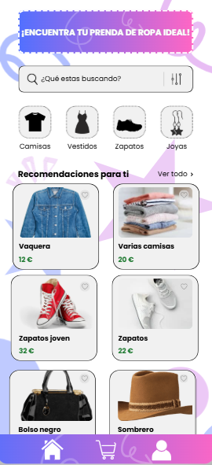
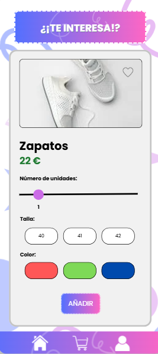
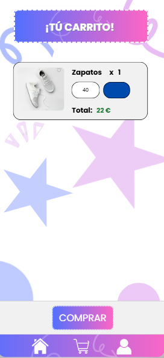
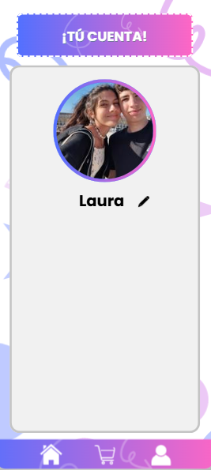
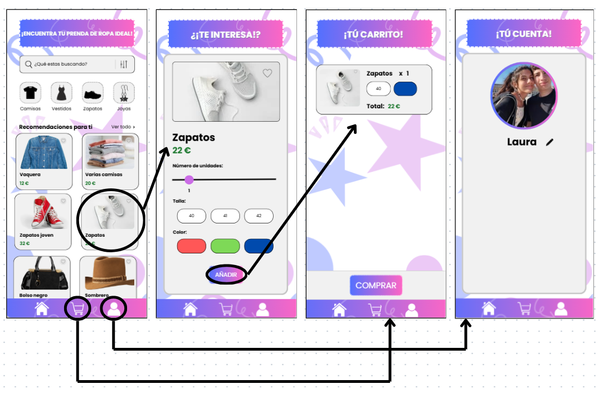
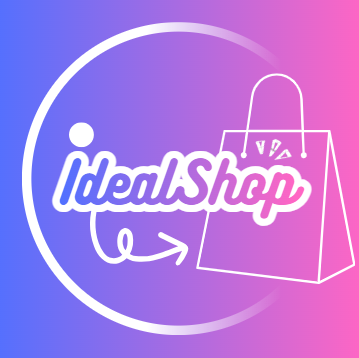

Creado por Laura Salas Ávila
# <u>Trabajo final Flutter MasterD</u>

Este es un proyecto de flutter para calificar, explicaré un poco de qué va a el proyecto y sus partes más importantes en este documento.
[TOC]

---
## 1. Conceptualización
### 1.1 ¿Cómo va a ser la app?¿De qué va la app?
La aplicación se llama IdealShop y es una tienda de moda multiplataforma (Android, Windows y Web).
Su objetivo es ofrecer una experiencia sencilla e intuitiva para que el usuario pueda explorar los productos, ver detalles de ellos, añadirlos al carrito y gestionar sus compras.

Está estructurada por categorías (camisas, pantalones, zapatos, bolsos, accesorios, etc.) y cada una cuenta con varios productos.
El usuario puede navegar por las distintas secciones, ver las imágenes de los productos, sus precios y descripciones, además de añadir artículos a su carrito.

La app tiene una interfaz moderna, animaciones suaves y un diseño limpio ya que está enfocado en la usabilidad y la coherencia visual para el usuario.

---

## 2. Diseño
### 2.1 ¿Diseño de la app?¿Dónde se diseñó?
El diseño se realizó principalmente en Canva, donde se planificaron las pantallas y la paleta de colores antes de comenzar la programación.
Al tener el diseño y la idea al completo, se trempezó a trabajar con Flutter. A continuación se muestran las pantallas y su navegación, como se puede ver, este diseño y el final de la aplicación se parecen en ciertas cosas, pero no llega a ser igual del todo. Se pondrá la foto del diseño y luego del resultado final.
#### 2.1.1 Home
Esta es la pantalla home, donde estan los productos junto con un buscador y unos botones para cada categoria de producto. EN la parte de abajo se ve una barra de navegación para ir a las otras pantallas.  
 
#### 2.1.2 Detalle de los productos
Esta es la pantalla de producto, en ella se muestra el producto en el que has hecho clic en la pantalla home, podrás ver la foto más grande y también puedes elegir ciertas caracteristicas que quieres de la prenda para después poder añadirla al carrito dándole al botón añadir.  

#### 2.1.3 Carrito
Este es el carrito, aquí verás todos los productos que has añadido junto con su cantidad, precio... En la parte inferior se puede ver el botón de comprar. (en la app se añadieron ciertas cosas como la posibilidad de eliminar un producto en concreto o vaciar todo el carro) 

#### 2.1.4 Perfil usuario
Esta es la pantalla del perfil del usuario, en este caso será fija, tendrá una foto del usuario, su nombre, su correo y más características. 

#### 2.1.5 Navegación
Esta es la navegación de la aplicación, se puede ir de un sitio a otro gracias a la barra de navegación de la parte de abajo, el usuario puede moverse libre y fácilmente por la aplicación.  

#### 2.1.6 Icono de la app
Este es el icono de la aplicación, se verá en las diferentes plataformas. 

---
Se aplicaron los principios de diseño responsivo, asegurando que la interfaz se adapte correctamente a diferentes dispositivos y tamaños de pantalla.
También se incorporaron animaciones con Hero, Fade y ScaleTransition para crear una experiencia más fluida al navegar entre pantallas.

---

## 3. Programación
### 3.1 Estructura del código
El proyecto está organizado siguiendo prácticas de arquitectura limpia.
La estructura se divide en tres capas principales:

- domain → Contiene las entidades.

- data → Gestiona la base de datos local (SQLite) mediante la clase DB.

- presentation → Contiene las pantallas, widgets y lógica visual de la app.
  
- ui → Contiene las animaciones.

Además, se utilizan archivos separados para cada pantalla, manteniendo el código limpio y fácil de mantener.

### 3.2 Elementos Implementados
- SQLite local para almacenar productos y carrito (con compatibilidad multiplataforma mediante sqflite_common_ffi).

- Animaciones personalizadas al navegar entre pantallas (Hero, PageRouteBuilder).

- Buscador funcional con filtrado dinámico de productos.

- Gestión de carrito, con aumento/disminución de cantidad y vaciado completo.

- Diseño tanto para escritorio como para móviles y web.

- Icono de aplicación personalizado para todas las plataformas.

- Uso de BloC para una gestión eficiente del estado.

- Carga inicial automática de productos si la base de datos está vacía.

---

## 4. Elementos destacables del desarrollo
### 4.1 Cosas del curso usadas
Durante el desarrollo de IdealShop se han aplicado numerosos conocimientos aprendidos en el curso de Flutter, entre ellos:

- Manejo de Widgets avanzados (ListView.builder, GridView, Hero, PageView, etc.).

- Uso de BloC como patrón de gestión de estado.

- Integración de bases de datos locales con SQLite.

- Implementación de animaciones personalizadas.

- Diseño con Material Design 3.

- Estructuración modular y buenas prácticas de desarrollo.

- Creación de un icono de app multiplataforma (Android, Web, Windows).

- Uso de imágenes locales en assets y su correcta configuración en pubspec.yaml.

---

## 5. Conclusión
Hacer esta aplicación me ha servido para aprender mucho más sobre Flutter, el proyecto lo veo bien y con posibilidad de poder evolucionar, incluso podría ser una aplicación que llegue a usarse en la actualidad.

